# Sample Image Classification
An implementation of image classification based on ResNet

## Requirement
- Python 3.6.5
- Tensorflow 1.10.1 
- Pillow 5.0.0
- numpy 1.14.5
- opencv-python 3.4.3.18

## Dataset
- [STL-10 dataset](https://cs.stanford.edu/~acoates/stl10/)

## Training
1) Download [STL-10 dataset](https://cs.stanford.edu/~acoates/stl10/)

2) Unzip the dataset zip file
```
tar -xvf ./path/to/file/stl10_binary.tar.gz
```

3) Train the model
```
python main.py --tr_img ./path/to/file/test_X.bin --tr_label ./path/to/file/test_y.bin --te_img ./path/to/file/train_X.bin --te_label ./path/to/file/train_y.bin
```

## Test
```
python main.py --mode test --pre_trained_model ./model/model_best_on_val --te_img ./path/to/file/train_X.bin --te_label ./path/to/file/train_y.bin
```

## Making grad cam
```
python main.py --mode grad_cam --pre_trained_model ./model/model_best_on_val --te_img ./path/to/file/train_X.bin --te_label ./path/to/file/train_y.bin
```

## Details
- The number of parameters : 2,952,928 (less than 3M)
- Top 1 accuracy(test data) : 78.3%
- I used learning rate scheduling
(49-th line in res_model.py)
- I used two data augmentation(The functions (data_aug(), extract_patch()) in util.py)

1) With random horizontal flip 
2) With single scale jittering

- I used separate training set, validataion set, and test set
(The function split_data() in util.py)

## Experimental Results

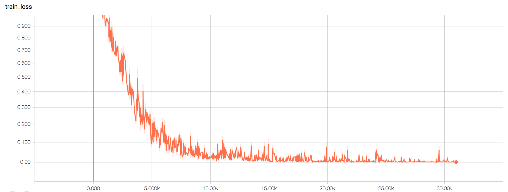
For each train batch, these are the train accuracy and train loss graphs 

If you want to see these results in tensorboard,
```
tensorboard --logdir=./log
```

log.txt in log directory : Training log file, which measured every epoch for total train data and validation data 

## Grad Cam Results
Correctly predicted samples

| Input | Grad cam |
| --- | --- |
| 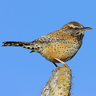 |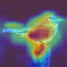| 
| 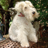 |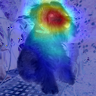|
| 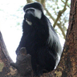 |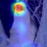|

Wrongly predicted samples

| Input | Grad cam |
| --- | --- |
| 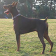 |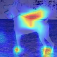| 
|  |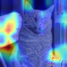|
| 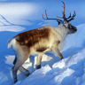 |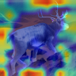|

## Reference
[1] https://github.com/mttk/STL10

- The functions read_labels and read_all_images in util.py are borrowed from [1]

[2] https://github.com/cydonia999/Grad-CAM-in-TensorFlow

- The function save_cam in util.py is borrowed from [2]